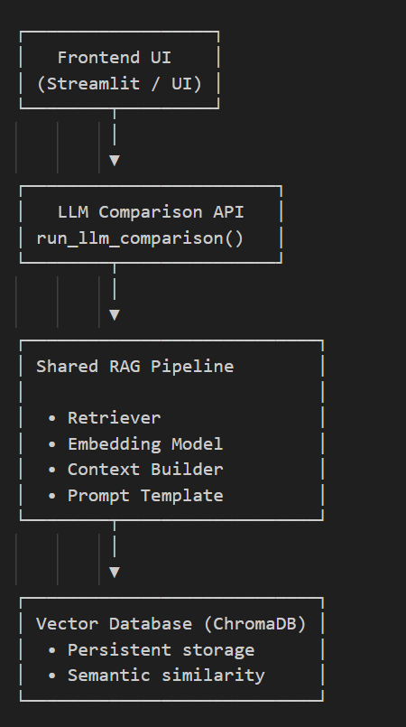
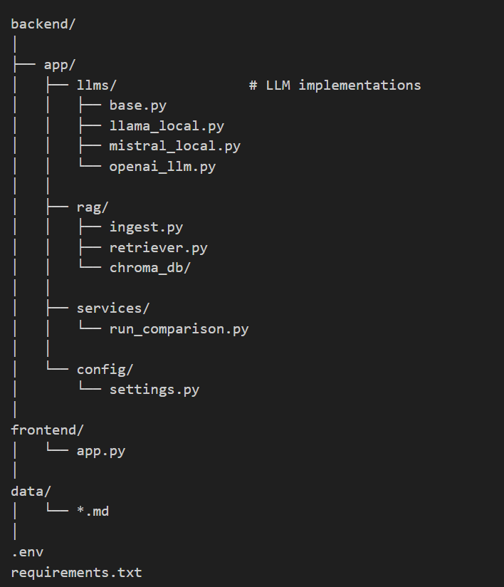
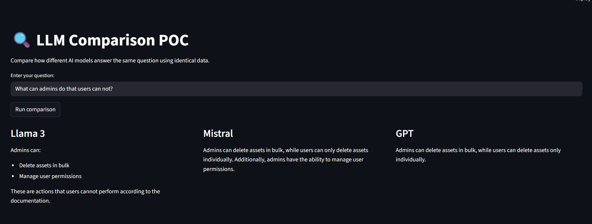

# LLM Comparison RAG POC

## Overview
This project is a proof-of-concept system that compares responses from multiple
large language models using a shared Retrieval-Augmented Generation (RAG) pipeline.

The goal is to demonstrate practical understanding of:
- modern LLM architectures
- vector search & embeddings
- prompt orchestration
- local vs hosted inference
- model-agnostic system design

## Internals

This project demonstrates:

+ Use of multiple LLM providers in a unified interface  
+ Local inference with Ollama (Llama 3, Mistral)  
+ Hosted inference via OpenAI API  
+ Shared RAG pipeline across all models  
+ Vector storage using ChromaDB  
+ Embedding-based semantic search  
+ Clean abstraction between models and services  
+ Environment-based configuration (.env)  
+ Modular backend architecture suitable for extension  

## System Architecture

LLMs:
- Llama 3 (local via Ollama)
- Mistral (local via Ollama)
- GPT (OpenAI API)

## RAG Flow 

1. User submits a question
2. Question is embedded using sentence-transformers
3. Top-K relevant chunks are retrieved from ChromaDB
4. Retrieved context is injected into the prompt
5. The same prompt + context is sent to each LLM
6. Responses are returned side-by-side for comparison

## Supported Models

| Model         | Type  | Provider |
| ------------- | ----- | -------- |
| Llama 3 8B    | Local | Ollama   |
| Mistral       | Local | Ollama   |
| GPT-4 / GPT-5 | API   | OpenAI   |

The system is model-agnostic — new LLMs can be added by
implementing the BaseLLM interface.

## Project Structure

## Setup Instructions

### Prerequisites

- Python 3.11+
- Ollama installed
- Git

### Install dependencies

python -m venv venv
source venv/bin/activate  # or venv\Scripts\activate
pip install -r requirements.txt

### Install local models

ollama pull llama3:8b
ollama pull mistral

### Create .env

OPENAI_API_KEY=your_key_here

### Ingest documents

python backend/app/rag/ingest.py

### Run the app

streamlit run frontend/app.py

### Application Demo

## Design Decisions

### Why ChromaDB?
- Lightweight
- Local persistence
- Ideal for prototyping RAG systems

### Why sentence-transformers?
- Fast
- Local embedding
- No API cost

### Why Ollama?
- Local inference
- No token cost
- Easy model switching

### Why model abstraction?
- Allows drop-in replacement of providers
- Mirrors production AI architecture

## Limitations

- No streaming responses yet
- No reranking layer
- No evaluation metrics
- Basic prompt formatting
- Single-vector retrieval only

## Future Improvements

- Add reranking (cross-encoder)
- Hybrid search (BM25 + vectors)
- Streaming token output
- LLM evaluation harness
- Response latency comparison
- Frontend in React + Tailwind
- Claude integration

## Skills Demonstrated

- Python backend architecture
- Retrieval-Augmented Generation (RAG)
- Vector databases
- Embeddings & similarity search
- Multi-LLM orchestration
- Local & hosted inference
- Environment configuration
- Modular system design

